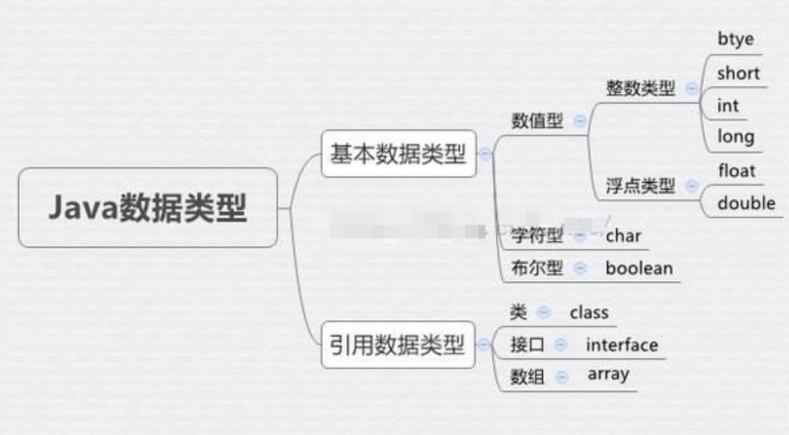
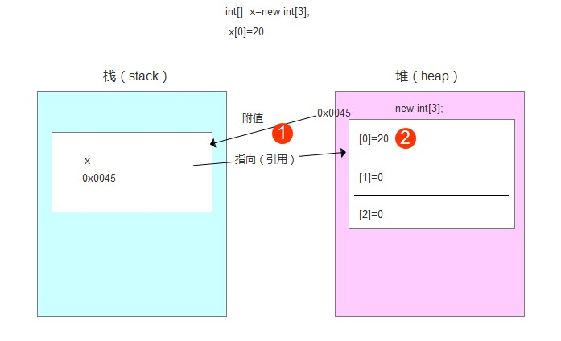

十进制转二进制
不断除以二的余数

二进制转十进制
个位=1
十位=2
百位=4
千位=8

# Java 程序的编译与运行

```java
public class Hello {
    public static void main(String[] args) {
        System.out.println("Hello, world!");
    }
}

```

类名要大写，方法参数 string args，公开的静态方法，void 返回的类型
必须命名为 Hello.java

运行java其实就是启动JVM
cmd 当前目录，产生 class
 ```javac Hello.java```
 执行生成的 class
 ```java Hello```


 java11 可以直接执行 .java 中的源码

## Eclipse
---

相关设置 preference

src---new class

下载 ide 练习插件

### 快捷键


# Java 基础

Java 是面向对象的语言，一个程序的基本单位就是 class

Java 入口程序的方法必须是静态方法 ，方法名必须为`main`，号内的参数 必须 是 String 数组


```java
注释// /* */
/**
*
*/
```

## 变量
---

```java
System.out.println("n = " + n); // 打印 n 的值
```

long型的结尾需要加L

Long也是整数类型！

```java
float f1 = 3.14f;
float f2 = 3.14e38f;//10的8次方，3.14x10^38 
```

浮点类型，即小数点可浮动，即小数
对于 float 类型，需要加上 f 后缀

布尔类型
boolean b1 =true;     false

char 类型要有单引号，且只有一个字符

引用类型  
string 类型是双引号

final 修饰符，转常量
```java
final double PI = 3.14; // PI 是一个常量，全部大写
```

```java
var sb = new StringBuilder();
StringBuilder sb = new StringBuilder();//这两句话是相同的
```

变量的作用域和{}有关，定义在尽量小的作用域

## 运算
---
### 整数
```int x = 12345 / 67; // 184 只保留整数部分 ```

++n n++

a = n >> 1; 2 进制位移运算

```java
n = 1 & 0; // 0 ip 地址做与运算
n = 1 | 0; // 1 或运算
n = ~0; // 1 非运算
n = 0 ^ 1; // 1 不相同则为 1 异或运算
```

### 浮点
float赋值时必须在数字后加上f或F

float单精度，double双精度。float类型可最大表示3.4x1038，而double类型可最大表示1.79x10308。

 在 C/C++ 中（也不知道是不是就在 VC++ 中这样），上述语句等号右边 0.1，我们以为它是个 float，但是编译器却把它认为是个 double（因为小数默认是 double），所以要报这个 warning,一般改成 0.1f 就没事了。

浮点数的 0.1 有误差 比较浮点数应使用：

```java
// 比较 x 和 y 是否相等，先计算其差的绝对值：
double r = Math.abs(x - y);
// 再判断绝对值是否足够小：
if (r 小于 0.00001) {
    // 可以认为相等
} 
else {
    // 不相等
}
```

24.0 /5 与 24 / 5

- 1.0 / 0 = - Infinity
- NaN 表示 Not a Number
- Infinity 表示无穷大
- Infinity 表示负无穷大

### 布尔
boolean true false

关系运算（与整数运算不同）
&& || ! 

```java
boolean isGreater = 5 > 3;
```

b ? x : y 
b = true/false 分别返回 x/y  
int x =  n >= 0 ? n : -n;

```java
boolean isPrimaryStudent = age>=6 && age <=12;
```

## 字符 字符串
---
一个`char`保存一个**Unicode字符**：
```java
char c1 = ‘A‘;
char c2 = ‘中‘;
char c3 = ‘\u0041‘;//十六进制0041 = 十进制65，字母A的Unicode编码是65
```

char是基本数据类型  
String是引用类型，是双引号

```java
String s =  ‘‘ABC\n\u4e2d\u6587‘‘;//6个字符 abc换行中文
```
字符串可以通过+号连接
```java
String s = s1 + " " + s2 + "!";
```
用+连接字符串和其他数据类型，会自动转为字符串再连接
三个双引号可以自动换行
字符串不可变

引用类型有空值`null`，指该变量不指向任何变量
```java
String s1 = null;
String s2; //没有赋值，是null
String s4 = ““;//指向空字符串，不是null
```

`String str = " "`和`String Str = new String`的区别：

先检查常量池有没有存在"abc"。前者在初始化的时候可能创建了一个对象，也可能一个对象也没有创建；后者因为new关键字，至少在内存中创建了一个对象，也有可能是两个对象（两个不同的地址都存放着abc）。

用StringBuffer/bulider来代替String可以减少内存开销？
单线程多线程？

注意要import java.lang.string

## 数组
---
格式：
```java
int[] ns = new int[5];
ns[0] = 68;
System.out.println(ns.length);//数组.length
```
`int[]`类型[]，`String[]`，数组本身都是引用类型。数组元素可以是别的类型。

特点：	
- 数组所有元素初始化为默认值，整型都是0，浮点型是0.0，布尔型是false；
- 数组一旦创建后，大小就不可改变。

数组是引用类型，搜索不能超出范围
```java
int[] ns = new int[] { 68, 79, 91, 85, 62 };
int[] ns = { 68, 79, 91, 85, 62 };
```

改变变量值，原先的变量值还在原地，只是再也不能用原先的变量名访问到它了

# 流程控制

## 输出
---

`println`是print line的缩写，表示输出换行

可以用`print`表示不换行输出

```java
System.out.print("hi");
```

格式化输出 printf

 ```java
 double d = 3.1415926;
 System.out.printf("%.2f\n", d); // 显示两位小数3.14
 System.out.printf("%.4f\n", d); // 显示4位小数3.1416
 ```

| 占位符 | 说明                   |
| ------ | ---------------------- |
| %d     | 格式化输出整数         |
| %x     | 格式化输出十六进制整数 |
| %f     | 浮点数                 |
| %e     | 科学技术法的浮点数     |
| %s     | 字符串                 |


## 输入
---
```java
import java.util.Scanner;

public class Main {
    public static void main(String[] args) {
        Scanner scanner = new Scanner(System.in); // 创建Scanner对象
        System.out.print("Input your name: "); // 打印提示
        String name = scanner.nextLine(); // 读取一行输入并获取字符串
        System.out.print("Input your age: "); // 打印提示
        int age = scanner.nextInt(); // 读取一行输入并获取整数
        System.out.printf("Hi, %s, you are %d\n", name, age); // 格式化输出
    }
}
```

要读取输入的字符串，使用`scanner.nextLine()`

要读取输入的整数，使用`scanner.nextInt()`

scanner会自动转换数据类型
nextDouble()...

```java
import java.util.Scanner;
public class Main {
    public static void main(String[] args) {
        Scanner scanner = new Scanner(System.in); 
        System.out.print("上次成绩: "); 
        float grade1 = scanner.nextInt(); 
        System.out.print("本次成绩: "); 
        float grade2 = scanner.nextInt(); 
        float fate =(grade2/grade1-1)*100;
        System.out.printf("成绩提升百分比：%.2f%%", fate); // 格式化输出。要转义百分号(%)，您需要像写两次%%
    }
}
```

## if
---
```java
String s1 = "hello";
String s2 = "HELLO".toLowerCase();
s1 == s2//false，指向不同的对象
s1.equals(s2)//true，内容是一样的
```

## switch
---
`注意要带上break`，顺序不影响逻辑
```java
public class Main {
    public static void main(String[] args) {
        int option = 99;//1,2,3..
        switch (option) {
        case 1:
            System.out.println("Selected 1");
            break;
        case 2:
            System.out.println("Selected 2");
            break;
        case 3:
            System.out.println("Selected 3");
            break;
        default:
            System.out.println("Not selected");
            break;//没匹配到任何case时会执行
        }
    }
}
```
也可用于比较字符串内容是否相等`case "apple":`

可以在ide中打开编译检查

哈希码：一种用特殊算法返回的数值  
String str3 = “aa”, str3.hashCode= 3104

https://blog.csdn.net/qq_40972879/article/details/79907910

integer的默认值为null
int的默认值为0，int不能为空
int不能是负数

random随机值：random() 方法可返回介于 0 ~ 1 之间的一个随机数
`int index = (int)(Math.random()*arr.length)`

## while 
---
sum += m++  //sum = m + sum ++

sum += ++m  //++ sum = m + sum

## do while
---
至少会循环一次

## for
---

`for each`循环 可以循环数组，List，Map等

```java
int[] ns = { 1, 4, 9, 16, 25 };
for (int n : ns) {
    System.out.println(n);
}//1 4 9 16 25
```

## break continue
---
配合if使用

break跳出循环，结束整个循环

continue是结束本次循环，直接执行下次循环

## 遍历数组
---

```java
import java.util.Arrays;

public class Main {
  public static void main(String[]args){
    int[] ns = { 1,1,2,3,5,8};
    System.out.println(Arrays.toString(ns));//快速打印数组内容
  }
}
```
`[1, 1, 2, 3, 5, 8] `

```java
Array.sort(ns,Collections.reverseOrder());
```
//升序，再反转？

## 数组排序
---

### 冒泡排序
每一轮循环都把最大的一个数放到末尾，因此下一个循环就可以剔除最后一个数，每一轮都比上一轮前进一位

```java
for (int i = 0; i < ns.length - 1; i++) {
 for (int j = 0; j < ns.length - i - 1; j++) {
   if (ns[j] > ns[j+1]) {//改成小于就是降序
   // 交换ns[j]和ns[j+1]:
   int tmp = ns[j];//中间变量
   ns[j] = ns[j+1];
   ns[j+1] = tmp;
```

`Arrays.sort()`import java.util.Arrays;JDK提供的升序排序

排序的时候字符串在内存中没变化，ns的指向变化了

## 多维数组
---
```java
public class Main {
    public static void main(String[] args) {
        int[][] ns = {
            { 1, 2, 3, 4 },
            { 5, 6, 7, 8 },
            { 9, 10, 11, 12 }
        };
        System.out.println(ns.length); // 3
        int[] arr0 = ns[0];
        System.out.println(arr0.length);//4
        System.out.println(ns[1][2]); // 7
    }
}
```
ns数组每个元素也是一个数组

打印二维数组
```java
for (int[] arr : ns) {
    for (int n : arr) {
        System.out.print(n);
        System.out.print(', ');
    }
    System.out.println();
}//注意这里的int[] arr : ns
```

`Arrays.deepTostring()`也可以

三维数组

## 命令行参数
---

```java
public class Main {
    public static void main(String[] args) {
        for (String arg : args) {
            if ("-version".equals(arg)) {
                System.out.println("v 1.0");
                break;
            }
        }
    }
}
```
"-version".equal(arg)//boolean，把arg放后面是为了防止arg为空

```
$ javac Main.java//编译
```

```
$ java Main -version//传递-version
v 1.0
```

# 面向对象编程

class（类，对象模版，是一种数据类型）和instance（实例）

## 方法
---

```java
class Person {
  public String name;
  pbulic int age;//两个field（变量）
}
```

```java
Person ming = new Person();/*Person类型的ming，创建person的实例*/
ming.name = "Xiao Ming"; // 对字段name赋值
ming.age = 12; // 对字段age赋值
System.out.println(ming.name); // 访问字段name
```

`public`的话，就可以从外部ming.name随便访问`field`//变量

`private`字段。在方法内部，我们就有机会检查参数对不对。比如，`setAge()`就会检查传入的参数，参数超出了范围，直接报错。这样，外部代码就没有任何机会把`age`设置成不合理的值。外部访问不到。

```java
class Person {
    private String name;
    private int age;

    public String getName() {
        return this.name;//this指当前对象
    }

    public void setName(String name) {
        if (name == null || name.isBlank()) {
        throw new IllegalArgumentException("invalid name");
    }
    this.name = name.strip(); // 去掉首尾空格
    }

    public int getAge() {
        return this.age;
    }

    public void setAge(int age) {
        if (age < 0 || age > 100) {
            throw new IllegalArgumentException("invalid age value");
        }
        this.age = age;
    }
}
```

ming.setName("xiao ming");

### 定义方法

```java
修饰符 方法返回类型 方法名(方法参数列表) {
    若干方法语句;
    return 方法返回值;
}
```

返回类型为`void`时可以省略return

private方法，同一个类的方法（内部方法）可以调用他，和变量一样。

```java
class Person {
    private String name;
    private int birth;
....
    public int getAge() {
        return calcAge(2019); // 调用private方法
    }

    // private方法:
    private int calcAge(int currentYear) {
        return currentYear - this.birth;
    }
}
```

`this`始终指向当前实例

可变参数用`类型...`定义，可变参数相当于数组类型
```java
class Group {
    private String[] names;

    public void setNames(String... names) {
        this.names = names;
    }
}
```
调用时，可以这么写：
```java
Group g = new Group();
g.setNames("Xiao Ming", "Xiao Hong", "Xiao Jun"); // 传入3个String
g.setNames("Xiao Ming", "Xiao Hong"); // 传入2个String
g.setNames("Xiao Ming"); // 传入1个String
g.setNames(); // 可以传入0个String，0不是null。不能传入null
```

```java
import java.util.Arrays;
public class Main {
    public static void main(String[] args) {
            Group g = new Group();
            g.setNames("Xiao Ming", "Xiao Hong", "Xiao Jun"); // 传入3个String
            System.out.println(Arrays.toString(g.getNames()));
            }
 }
//int[] ns = { 68, 79, 91, 85, 62 }
 class Group {
    private String[] names;
    public void setNames(String... names) {
        this.names = names;
    }
    public String[] getNames(){;
        return names;
    }
}
```

### 引用参数

基本数据类型是值传递int float，传递的是调用方值的拷贝。

引用数据类型是引用传递class，interface，array：传递是对象的引用。



https://www.cnblogs.com/ibelieve618/p/6380328.html  
String str = new String("abc");
str就是新建对象的引用吧， str放在栈中里面，存放着字符串abc存放在堆中的地址

不可变对象String，调用方修改变量值（赋值）会有一个新的地址引用，指向新的对象，所以改了值后不变，调用方修改变量值只是将自己作用域下的变量指向了新的对象，不影响接收方的参数变量。

如果一个对象，在它创建完成之后，不能再改变它的状态，那么这个对象就是不可变的。不能改变状态的意思是，不能改变对象内的成员变量，包括基本数据类型的值不能改变，引用类型的变量不能指向其他的对象，引用类型指向的对象的状态也不能改变。  
s只是一个String对象的引用，并不是对象本身。对象在内存中是一块内存区，成员变量越多，这块内存区占的空间越大。引用只是一个4字节的数据，里面存放了它所指向的对象的地址，通过这个地址可以访问对象。  
也就是说，s只是一个引用，它指向了一个具体的对象，当s=“123456”; 这句代码执行过之后，又创建了一个新的对象“123456”， 而引用s重新指向了这个心的对象，原来的对象“ABCabc”还在内存中存在，并没有改变。

引用类型可以赋值为null，表示空，但基本类型不能赋值为null
```java
public class Main {
    public static void main(String[] args) {
        Person p = new Person();
        String bob = "Bob";//创建了一个不可变对象bob
        p.setName(bob); // 传入bob变量，bob是个对象的引用
        System.out.println(p.getName()); // "Bob"
        bob = "Alice"; // bob改名为Alice，创建了新的对象，bob的指向改变了。原来指向的对象成员变量没变，原来的指向已经传递了，没变
        System.out.println(p.getName()); // "Bob"还是"Alice"?bob
    }
}
```

可变对象Array（数组），修改变量值时，调用方修改变量值相当于自己作用域下的变量所指向的对象的值，会影响接收方的变量。

```java
public class Main {
    public static void main(String[] args) {
        Person p = new Person();
        String[] fullname = new String[] { "Homer", "Simpson" };
        p.setName(fullname); // 传入fullname数组，传递引用类型参数，将地址传过去
        System.out.println(p.getName()); // "Homer Simpson"
        fullname[0] = "Bart"; // fullname数组的第一个元素修改为"Bart"，地址未发生改变，可变对象，其指向的对象的成员变量是可以任意改变的。
        System.out.println(p.getName()); // "Homer Simpson"还是"Bart Simpson"?是bart simpson
    }
}
```

JVM执行main()函数，在栈内存中开辟一个空间，存放x变量（x变量是局部变量）。  
同时，在堆内存中也开辟一个空间，存放new int[3]数组，堆内存会自动内存首地址值，如0x0045。  
数组在栈内存中的地址值，会附给x，这样x也有地址值。所以，x就指向（引用）了这个数组。此时，所有元素均未附值，但都有默认初始化值0。  
改变的是数组的元素，赋值。


string 是使用副本（id不同）：如果使用元组只能复制，class中使用的string其实是一个string的副本。  
数组是引用（id相同）：而[   ]是可变的，[    ]是容器，class中使用的[     ]就是通过内存地址引用原来的数组

String属于对象（类），因为要new String。在python中，一切皆对象。


## 构造方法
---
用在class中，可以一次性传入参数，不需要SetAge()...

构造方法没有返回值，且需要用new调用。每个类都有构造方法，没有就会生成一个空的构造方法。

```java
class Person {
    private String name; // 默认初始化为null
    private int age; // 默认初始化为0
    private boolean isok;//默认值为false
    
    public Person() {
    }
}
```

调用另一个构造方法的语法是this()，

```java
class Person {
    private String name;
    private int age;

    public Person(String name, int age) {
        this.name = name;
        this.age = age;
    }

    public Person(String name) {
        this(name, 18); // 调用另一个构造方法Person(String, int)
    }

    public Person() {
        this("Unnamed"); // 调用另一个构造方法Person(String)
    }
}
```

## 方法重载
---
同名的方法，只有参数不同。调用时用不同的参数可以调用不同的方法。overload

```java
s.indexOf('t')
s.indexOf("st", 4);
```

## 继承
---
```java
class Person {
    private String name;
    private int age;

    public String getName() {...}
    public void setName(String name) {...}
    public int getAge() {...}
    public void setAge(int age) {...}
}

class Student extends Person {
    // 不要重复name和age字段/方法,
    // 只需要定义新增score字段/方法:
    private int score;

    public int getScore() { … }
    public void setScore(int score) { … }
}
```
person也会自动extends Object类，任何类都会继承自某个类，除了Object。

一个类有且仅有一个父类

### protected

```java
class Person {
    private String name;
    private int age;
}

class Student extends Person {
    public String hello() {
        return "Hello, " + name; // 编译错误：无法访问name字段
    }
}
```

子类无法访问父类的private字段或者private方法。例如，Student类就无法访问Person类的name和age字段。为了让子类可以访问父类的字段，我们需要把private改为protected。用protected修饰的字段可以被子类访问：

```java
class Person {
    protected String name;
    protected int age;
}

class Student extends Person {
    public String hello() {
        return "Hello, " + name; // OK!
    }
}
```
`protected`关键字可以把字段合方法的访问权控制在继承树内部

子类不会继承任何父类的构造方法。子类默认的构造方法是编译器自动生成的，不是继承的。

**任何`class`的构造方法，第一行语句必须是调用父类的构造方法。**如果没有明确地调用父类的构造方法，编译器会帮我们自动加一句`super();`，如果父类刚好是默认的无参数构造方法，就不会报错，所以，`Student`类的构造方法实际上是这样：

```java
public Student(String name, int age, int score) {
     super(); // 自动调用父类的构造方法
     this.score = score;
}
```
如果Person类并没有无参数的默认构造方法，编译失败。改为：
```java
super(name, age); // 调用父类的构造方法Person(String, int)
```

因此我们得出结论：如果父类没有默认的构造方法，子类就必须显式调用super()并给出参数以便让编译器定位到父类的一个合适的构造方法。子类不会继承任何父类的构造方法

### 阻止继承

只要某个class没有`final`修饰符，那么任何类都可以从该class继承。
```java
public sealed class Shape permits Rect, Circle, Triangle {
    ...
}//sealed类，只允许3个类继承它，java15

public final class Rect extends Shape {...}
```

### 向上转型
```java
//向上转型是一定成功的，除非他们本来就没关系

Student s = new Student();
Person p = s; // upcasting, ok
Object o1 = p; // upcasting, ok
Object o2 = s; // upcasting, ok
```
如果存在，向上转型是一定成功的，变得更佳抽象**（向上向下 看的是前面的引用类型）**

### 向下转型

变得更加具体，不一定成功

```java
Person p = new Student();//p实例的引用类型为Person，指向Student类型
if (p instanceof Student) {
    // 只有判断成功才会向下转型:true
    Student s = (Student) p; // 一定会成功
}//本来是Person类型转换为Student类型，向下
```

```java
public class Main {
    public static void main(String[] args) {
        Object obj = "hello";//s的引用类型为Object，指向String类型，Object为任何类型的父类
        if (obj instanceof String s) {
            // 可以直接使用变量s:判断完直接给s转型
            System.out.println(s.toUpperCase());
        }
    }
}//如果obj确实是String类型，那就直接转为String
```


### 继承和组合
`student`和`person`是`is`关系
`book`和`student`是`has`关系：

```java
class Student extends Person {
    protected Book book;
    protected int score;
}
```


## 多态
---
子类定义了一个与父类签名完全相同的方法，覆写。

```java
class Person {
    public void run() { … }
}

class Student extends Person {
    // 不是Override，因为参数不同:
    public void run(String s) { … }
    // 不是Override，因为返回值不同:
    public int run() { … }
}
```
```java
class Student extends Person {
    @Override //加上@Override可以让编译器帮助检查是否进行了正确的覆写
    public void run() {
        System.out.println("Student.run");
    }
}
```

Java的实例方法调用是基于运行时的实际类型的动态调用，而非变量的声明类型。

```java
public class Main {
    public static void main(String[] args) {
        Person p = new Student();
        p.run(); // 应该打印Person.run还是Student.run?
    }
}

class Person {
    public void run() {
        System.out.println("Person.run");
    }
}

class Student extends Person {
    @Override
    public void run() {
        System.out.println("Student.run");
    }
}//输出结果Student.run
```

多态：
```java
public void runTwice(Person p) {
    p.run();
    p.run();
}
```
**就是说子类的引用类型可以是任何父类，用父类还可以更加抽象，例如使用多态？**

传入的参数类型是`Person`，我们无法知道传入的实际类型是`Person `还是其它子类`Student`（覆写了run方法）。

因此，我们可以利用这个不确定特性，对某个类型调用其不同子类覆写的方法。

例如：
```java
public class Main {
    public static void main(String[] args) {
        // 给一个有普通收入、工资收入和享受国务院特殊津贴的小伙伴算税:
        Income[] incomes = new Income[] {
            new Income(3000),
            new Salary(7500),
            new StateCouncilSpecialAllowance(15000)
        };//创建每个类的实例，然后存在数组里面，储存的是引用地址？
        System.out.println(totalTax(incomes));
    }

    public static double totalTax(Income... incomes) {//可变参数相当于数组类型
        double total = 0;
        for (Income income: incomes) {
            total = total + income.getTax();//只需要和income打交道，完全不需要知道Salary等等的存在
        }
        return total;
    }//java中静态方法不可以直接调用非静态方法和成员，也不能使用this关键字（这就是这个问题的原因，我用静态的main方法调用了非静态的的get方法）。
}

class Income {
    protected double income;

    public Income(double income) {
        this.income = income;
    }

    public double getTax() {
        return income * 0.1; // 税率10%
    }
}

class Salary extends Income {
    public Salary(double income) {
        super(income);
    }

    @Override
    public double getTax() {
        if (income <= 5000) {
            return 0;
        }
        return (income - 5000) * 0.2;
    }
}

class StateCouncilSpecialAllowance extends Income {
    public StateCouncilSpecialAllowance(double income) {
        super(income);
    }

    @Override
    public double getTax() {
        return 0;
    }
}
```
super调用父类被覆写的方法：
```java
class Person {
    protected String name;
    public String hello() {
        return "Hello, " + name;
    }
}

Student extends Person {
    @Override
    public String hello() {
        // 调用父类的hello()方法:
        return super.hello() + "!";
    }
}
```

### final
如果final
```java
class Person{
  public final String hello() {
        return "Hello, " + name;
    }
}  
```
无法覆写
```java
..
final String name = "Unamed";
..
p.name = "New Name"; // compile error!
```
```java
    public final String name;
    public Person(String name) {
        this.name = name;//在构造方法初始化的时候可以赋值name
    }
```

以前那个的final是常量

## 抽象类

---
如果父类的方法本身不需要实现任何功能，仅仅是为了定义方法签名，目的是让子类去覆写它，那么，可以把父类的方法声明为抽象方法：
```java
abstract class Person {
    public abstract void run();
}
```
必须把Person类本身也声明为abstract，才能正确编译它。就是说方法和类都要声明为抽象才能编译。

```java
Person p = new Person(); // 编译错误
```
abstract无法实例化

子类必须覆写抽象方法

面向抽象编程，不关心子类如何实现抽象方法的。子类必须得覆写实现抽象方法，相当于制定了规范。

## 接口
---
如果一个抽象类没有字段，所有方法都是抽象方法，就可以改写为`interface`，（一般？抽象类是is关系，interface是实现即has关系）主要区别：一个类只能从一个类中继承，但一个类可以实现多个接口。接口不能有字段。

```java
interface Person {
    void run();//不需要public abstrct写不写都一样
    String getName();
}
class Student implements Person {
    private String name;

    public Student(String name) {
        this.name = name;
    }//接口没有字段，无需构造方法

    @Override
    public void run() {
        System.out.println(this.name + " run");
    }

    @Override
    public String getName() {
        return this.name;
    }
}
```
```java
class Student implements Person, Hello { // 实现了两个interface
    ...
}
```
抽象类可以定义实例字段，可以定义抽象，非抽象方法。接口不可以实例字段，可以定义抽象方法，定义不了非抽象因为默认转为抽象，可以定义default方法。

接口继承：
```java
interface Hello{
  ..
}
interface Person extends Hello{
  ..
}
```

### default方法
default与普通方法不一样的地方：无法访问字段，因为接口没有字段，但可以调用方法
```java
interface Person {
    String getName();
    default void run() {
        System.out.println(getName() + " run");
    }
}//
```

## 静态字段和静态方法
在一个class中定义的字段，我们称之为实例字段。实例字段，在不同的实例中是独立的，互不影响。static静态字段，会使其只有一个共享的空间，不同实例会影响。实际上是属于类class的，不属于实例。
```java
public class Main {
    public static void main(String[] args) {
        Person ming = new Person("Xiao Ming", 12);
        Person hong = new Person("Xiao Hong", 15);
        ming.number = 88;
        System.out.println(hong.number);
        hong.number = 99;
        System.out.println(ming.number);
    }
}//88 99
```
静态字段不属于实例，指向`Person class`的静态字段，可以用类名来访问`Person.number`

静态方法：
```java
public class Main {
    public static void main(String[] args) {
        Person.setNumber(99);
        System.out.println(Person.number);
    }
}
//不用Person ming = new Person()；了
class Person {
    public static int number;

    public static void setNumber(int value) {
        number = value;
    }
}
```
无法使用`this`变量，也无法访问实例字段，只能访问静态字段。实例变量（ming）可以调用静态方法变量，但会有警告。

静态方法可以不用new就对类中的方法进行调用，所以用在工具类。
- Arrays.sort()
- Math.random()

main()也是静态方法。

接口不可定义实例字段，但可以定义静态字段，并且必须为final型。（如果 在接口定义变量字段那默认就定义成这个类型）
```java
public interface Person {
    public static final int MALE = 1;
    public static final int FEMALE = 2;
}
```
```java
public class Person {

	// TODO

	String name;
	static int count;

	public Person(String name) {
		count++;//count是属于类的不属于实例，属于person类，每次新建一个实例就会+1
		this.name = name;
	}
	public static int getCount() {
		return count;
	}

}
public class Main {
	public static void main(String[] args) {
		// TODO: 给Person类增加一个静态字段count和静态方法getCount，统计实例的个数
		Person p1 = new Person("小明");
		System.out.println(Person.getCount()); // 1
		Person p2 = new Person("小红");
		System.out.println(Person.getCount()); // 2
```

## 包
---
`packgae`一个类总是属于某个包， `包名.类名`，注意，包名没有父子关系，java.util和java.util.zip是不同的包。

JDK的Arrays类存放在包java.util下面，因此，完整类名是java.util.Arrays。

```java
package ming; // 申明包名ming

public class Person {
}
```

ming.Person

`package mr.jun; // 申明包名mr.jun`

只要包名不同，类就不同，不写包名用的是默认包

在src目录下执行javac命令
> javac -d ../bin ming/Person.java hong/Person.java mr/jun/Arrays.java

```java
// Person.java
package ming;

// 导入完整类名:
import mr.jun.Arrays;//导入Arrays类，导入的是类！！注意最后一个是大写的所以是类，其实类就是class文件，因为是同名的

public class Person {
    public void run() {
        Arrays arrays = new Arrays();
        mr.jun.Arrays arrays = new mr.jun.Arrays();//如果不导入包
    }
}
```

不推荐用`*`导包

```java
// 导入System类的所有静态字段和静态方法:（很少使用）!!!
import static java.lang.System.*;

public class Main {
    public static void main(String[] args) {
        // 相当于调用System.out.println(…)
        out.println("Hello, world!");
    }//此处导入了java.lang.System.*，由于导入的是静态方法，System是一个类，此类中的所有静态方法被导入进来了，out就是其中一个静态方法?
```
System类已经默认导入了，java.lang目录下的内容（类）都不用导入 java.lang.*。java.lang.reflect包仍需要手动导入

因为Field并不是java.lang包下的直接子类，ß而是java.lang.reflect包下的子类，所以需要导包，只有lang包下的直接子类不需要导包例如：java.lang.String就不需要导包
```java
package test;

import java.text.Format;

public class Main {
    public static void main(String[] args) {
        java.util.List list; // ok，使用完整类名 -> java.util.List
        Format format = null; // ok，使用import的类 -> java.text.Format
        
        String s = "hi"; // ok，使用自动导入的java.lang.*包的String -> java.lang.String
        System.out.println(s); // ok，使用java.lang包的System -> java.lang.System
        
        MessageFormat mf = null; // 编译错误：无法找到MessageFormat: MessageFormat cannot be resolved to a type
    }
}  
```
class名字相同时只能导入 其中一个

唯一的包名，和注意不要和java.lang和jdk常用类重名

### 包的作用域

不同package下public类或接口可以被其他类访问：

```java
package abc;

public class Hello {
    public void hi() {
    }
}
```
```java
package xyz;

class Main {
    void foo() {
        // Main可以访问Hello
        Hello h = new Hello();
        //public的方法
        h.hi();
    }
}
```
public方法可以被其他类调用，前提是其类也能访问到

private字段，方法的访问权限限定在了class的内部，一般把private放在后面，方便阅读。

**嵌套类（内部类），可以访问类的private方法，是特殊。**？

protected用于继承关系，限定在继承树中

包作用域是指一个类允许访问同一个package的没有public、private修饰的class，以及没有public、protected、private修饰的字段和方法。  
也就是什么都没有修饰的class，在一个包下可以互相访问，类和方法默认的权限都是package

```java
package abc;
// package权限的类:
class Hello {
    // package权限的方法:
    void hi() {
    }
}
```
```java
package abc;

class Main {
    void foo() {
        // 可以访问package权限的类:
        Hello h = new Hello();
        // 可以调用package权限的方法:
        h.hi();
    }
}
```

局部变量，形参

一个.java文件只能包含一个public类，但可以包含多个非public类。如果有public类，文件名必须和public类的名字相同！

## 内部类

---

一个类定义在另一个类的内部

```java
class Outer {
    class Inner {
        // 定义了一个Inner Class
    }
}
```

inner实例必须依附于Outer实例

```java
public class Main {
    public static void main(String[] args) {
        Outer outer = new Outer("Nested"); // 实例化一个Outer
        Outer.Inner inner = outer.new Inner(); // 实例化一个Inner Outer.Inner类型 outer实例
        inner.hello();
    }
}

class Outer {
    private String name;

    Outer(String name) {
        this.name = name;
    }

    class Inner {
        void hello() {
            System.out.println("Hello, " + Outer.this.name);//访问Outer的name
        }
    }
}
```
内部类可以引用Outer实例，也可以访问Outer类的private字段。编译后的结果`Outer`类被编译为`Outer.class`，而`Inner`类被编译为`Outer$Inner.class`。

静态内部类

```java
public class Main {
    public static void main(String[] args) {
        Outer.StaticNested sn = new Outer.StaticNested();
        sn.hello();
    }//不再依附Outer但可以访问private
}

class Outer {
    private static String NAME = "OUTER";

    private String name;

    Outer(String name) {
        this.name = name;
    }

    static class StaticNested {
        void hello() {
            System.out.println("Hello, " + Outer.NAME);
        }
    }
}
```

### 匿名类
不需要在Outer Class中明确地定义这个Class，而是在方法内部，通过匿名类（Anonymous Class）来定义。

```java
public class Main {
    public static void main(String[] args) {
        Outer outer = new Outer("Nested");
        outer.asyncHello();
    }
}

class Outer {
    private String name;

    Outer(String name) {
        this.name = name;
    }

    void asyncHello() {
        Runnable r = new Runnable() {
            @Override
            public void run() {
                System.out.println("Hello, " + Outer.this.name);
            }
        };//匿名类实现了runnable接口，并被new了出来
      //就是在new接口的时候{实现它}，然后实例化后，引用类型向上转型为Runnable（看上去是不合理因为Runnable是接口无法被实例化）
        new Thread(r).start();//？
    }
}
```

匿名类和Inner Class一样，可以访问Outer Class的`private`字段和方法。不关心类名，可以少写很多代码

```java
import java.util.HashMap;

public class Main {
    public static void main(String[] args) {
        HashMap<String, String> map1 = new HashMap<>();
        HashMap<String, String> map2 = new HashMap<>() {}; // 匿名类!
        HashMap<String, String> map3 = new HashMap<>() {
            {
                put("A", "1");
                put("B", "2");
            }
        };//匿名类，并添加了static代码。?
        System.out.println(map3.get("A"));
    }
}
```

`map1`是一个普通的`HashMap`实例，但`map2`是一个匿名类实例，只是该匿名类继承自`HashMap`。`map3`也是一个继承自`HashMap`的匿名类实例，并且添加了`static`代码块来初始化数据。观察编译输出可发现`Main$1.class`和`Main$2.class`两个匿名类文件。

## classpath和jar
---
classpath就是JVM的一个环境变量，加载类的时候去哪个目录找。

classapath是.;C:\work\project1\bin;C:\shared时  
JVM会按照如下查找abc.xyz.Hello：
- <当前目录>\abc\xyz\Hello.class
- C:\work\project1\bin\abc\xyz\Hello.class
- C:\shared\abc\xyz\Hello.class

```
java -cp .;C:\work\project1\bin;C:\shared abc.xyz.Hello
```

-cp是-classpath的简写，如果不写-cp...则默认当前目录搜索hello。JVM会自己把自带的rt.jar放入cp。

```
C:\work> java -cp . com.example.Hello
```
.代表当前目录

### jar包

jar包就是zip格式，第一层目录不是bin。hello.zip是一个jar包：


jar包还可以包含一个MAINFEST.MF纯文本，有了他指定Main-Class，提供了jar包的信息，可以直接使用如下命令
```
java -jar hello.jar
```

开源构建工具`Maven`，可以方便地创建jar包

## 模块
Java 9引入模块，把rt.jar拆分成几十个模块，格式为.jmod，所有模块都直接或间接的依赖java.base根模块。
```
oop-module
├── bin
├── build.sh
└── src
    ├── com
    │   └── itranswarp
    │       └── sample
    │           ├── Greeting.java
    │           └── Main.java
    └── module-info.java
```
`module-info.java`就是模块的描述文件

```java
module hello.world {
	requires java.base; // 可不写，任何模块都会自动引入java.base
	requires java.xml;
}
```
```java
package com.itranswarp.sample;

// 必须引入java.xml模块后才能使用其中的类:
import javax.xml.XMLConstants;

public class Main {
	public static void main(String[] args) {
		Greeting g = new Greeting();
		System.out.println(g.hello(XMLConstants.XML_NS_PREFIX));
	}
}
```
运行模块，打包JRE？
https://www.liaoxuefeng.com/wiki/1252599548343744/1281795926523938

要想被其他的模块访问，必须将其导出。
```java
module hello.world {
    exports com.itranswarp.sample;

    requires java.base;
	requires java.xml;
}
```