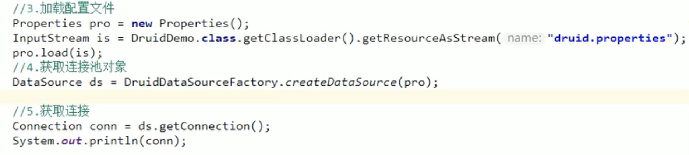

# JDBC

JDBC其实就是一组接口，然后JDBC驱动是实现了这些接口的类。

Mysql驱动就是一个jar包，我们编写代码只需要引用java.sql包下面的相关接口，由此再间接通过MySQL驱动的jar网络访问服务器。即引入jar包即可。

```xml
<dependency>
    <groupId>mysql</groupId>
    <artifactId>mysql-connector-java</artifactId>
    <version>5.1.47</version>
    <scope>runtime</scope>
</dependency>
```

如果把`runtime`改成`compile`，虽然也能正常编译，但是在IDE里写程序的时候，会多出来一大堆类似`com.mysql.jdbc.Connection`这样的类，非常容易与Java标准库的JDBC接口混淆，所以坚决不要设置为`compile`。

# 增删改查

## JDBC连接

```java
jdbc:mysql://localhost:3306/learnjdbc?useSSL=false&characterEncoding=utf8
```

不使用SSL加密，注意MySQL的UTF-8是`utf8`

```java
// JDBC连接的URL, 不同数据库有不同的格式:
String JDBC_URL = "jdbc:mysql://localhost:3306/test";
String JDBC_USER = "root";
String JDBC_PASSWORD = "password";
// 获取连接:
Connection conn = DriverManager.getConnection(JDBC_URL, JDBC_USER, JDBC_PASSWORD);
// TODO: 访问数据库...
// 关闭连接:
conn.close();
```

`DriverManager`提供的静态方法`getConnection()`，会自动扫描classpath

```java
try (Connection conn = DriverManager.getConnection(JDBC_URL, JDBC_USER, JDBC_PASSWORD)) {
    ...
}//使用try(resource)来释放连接，相当于try再带上一个参数
```

### try catch释放

[Java中如何通过try优雅地释放资源？ (baidu.com)](https://baijiahao.baidu.com/s?id=1663842880094685180&wfr=spider&for=pc)

## JDBC查询

第一步，通过`Connection`提供的`createStatement()`方法创建一个`Statement`对象，用于执行一个查询；

第二步，执行`Statement`对象提供的`executeQuery("SELECT * FROM students")`并传入SQL语句，执行查询并获得返回的结果集，使用`ResultSet`来引用这个结果集；

第三步，反复调用`ResultSet`的`next()`方法并读取每一行结果。

```java
try (Connection conn = DriverManager.getConnection(JDBC_URL, JDBC_USER, JDBC_PASSWORD)) {
    try (Statement stmt = conn.createStatement()) {
        try (ResultSet rs = stmt.executeQuery("SELECT id, grade, name, gender FROM students WHERE gender=1")) {
            while (rs.next()) {
                long id = rs.getLong(1); // 注意：索引从1开始，根据select语句的对应位置
                long grade = rs.getLong(2);
                String name = rs.getString(3);
                int gender = rs.getInt(4);
            }
        }
    }
}//在try{}内一直开启连接
```

- rs.next()用于判断是否有下一行记录，如果有，将自动把当前行移动到下一行
- `Statement`和`ResultSet`也都是需要关闭的资源，新建查询和执行查询？
- `ResultSet`获取列时，索引从`1`开始而不是`0`；

### SQL注入

```java
stmt.executeQuery("SELECT * FROM user WHERE login='" + name + "' AND pass='" + pass + "'");
```

如果变量name，pass里面恶意注入了一些''符号，可能会导致直接通过

要避免SQl注入，就得使用`PreparedStatement`，可以完全避免SQL注入问题，因为他是用`？`做为占位符的，只能修改占位符上的数据，就是不会影响到隔壁的语句，

```java
String sql = "SELECT * FROM user WHERE login=? AND pass=?";
PreparedStatement ps = conn.prepareStatement(sql);
ps.setObject(1, name);
ps.setObject(2, pass);
```

速度还更快。createStatement，

```java
try (Connection conn = DriverManager.getConnection(JDBC_URL, JDBC_USER, JDBC_PASSWORD)) {
    try (PreparedStatement ps = conn.prepareStatement("SELECT id, grade, name, gender FROM students WHERE gender=? AND grade=?")) {
        ps.setObject(1, "M"); // 注意：索引从1开始
        ps.setObject(2, 3);
        try (ResultSet rs = ps.executeQuery()) {
            while (rs.next()) {
                long id = rs.getLong("id");
                long grade = rs.getLong("grade");
                String name = rs.getString("name");
                String gender = rs.getString("gender");
            }
        }
    }
}
```

`ResultSet`对象。另外注意到从结果集读取列时，使用`String`类型的列名比索引要易读，而且不易出错。

都是三步。

## 类型转换，JDBC分析

| SQL数据类型   | Java数据类型             |
| :------------ | :----------------------- |
| BIT, BOOL     | boolean                  |
| INTEGER       | int                      |
| BIGINT        | long                     |
| REAL          | float                    |
| FLOAT, DOUBLE | double                   |
| CHAR, VARCHAR | String                   |
| DECIMAL       | BigDecimal               |
| DATE          | java.sql.Date, LocalDate |
| TIME          | java.sql.Time, LocalTime |

Connection是一个接口

DriverManager.getConnection是一个类的静态方法，会自动找到一个最合适的驱动

conn.prepareStatement接口要实现的一个方法

PreparedStatement是一个接口

Resultset也是一个接口

https://www.cnblogs.com/alsf/p/6685607.html

接口实例化问题，只是类型是接口，实际指向实现类

## JDBC更新

增删改查，查就是使用`PreparedStatement`进行各种`SELECT`，增：

### 插入

```java
try (Connection conn = DriverManager.getConnection(JDBC_URL, JDBC_USER, JDBC_PASSWORD)) {
    try (PreparedStatement ps = conn.prepareStatement(
            "INSERT INTO students (id, grade, name, gender) VALUES (?,?,?,?)")) {
        ps.setObject(1, 999); // 注意：索引从1开始
        ps.setObject(2, 1); // grade
        ps.setObject(3, "Bob"); // name
        ps.setObject(4, "M"); // gender
        int n = ps.executeUpdate(); // 1，返回插入记录的数量
    }
}
```

也是执行`PreparedStatement`，不过最后执行的不是executeQuery，而是executeUpdate。

#### 自增

```java
try (Connection conn = DriverManager.getConnection(JDBC_URL, JDBC_USER, JDBC_PASSWORD)) {
    try (PreparedStatement ps = conn.prepareStatement(
            "INSERT INTO students (grade, name, gender) VALUES (?,?,?)",
            Statement.RETURN_GENERATED_KEYS)) {
        ps.setObject(1, 1); // grade
        ps.setObject(2, "Bob"); // name
        ps.setObject(3, "M"); // gender
      //没有id
        int n = ps.executeUpdate(); // 1
        try (ResultSet rs = ps.getGeneratedKeys()) {
            if (rs.next()) {
                long id = rs.getLong(1); // 注意：索引从1开始
            }
        }
    }
}
```

- 对于要返回自增的key是什么，才这么做：普通的插入也会自增
- 对于自增主键，创建`PreparedStatement`的时候，指定一个`RETURN_GENERATED_KEYS`标志位，就是多传入一个参数常量

- 执行`executeUpdate()`方法后，必须调用`getGeneratedKeys()`获取一个`ResultSet`对象
- 如果一次插入多条记录，那么这个`ResultSet`对象就会有多行返回值。如果插入时有多列自增，那么`ResultSet`对象的每一行都会对应多个自增值？（自增不一定就要是主键）

### 更新

改

```java
try (Connection conn = DriverManager.getConnection(JDBC_URL, JDBC_USER, JDBC_PASSWORD)) {
    try (PreparedStatement ps = conn.prepareStatement("UPDATE students SET name=? WHERE id=?")) {
        ps.setObject(1, "Bob"); // 注意：索引从1开始
        ps.setObject(2, 999);
        int n = ps.executeUpdate(); // 返回更新的行数
    }
}
```

插入和更新在代码层面上没有不同，只有SQL语句不同

### 删除

```java
try (Connection conn = DriverManager.getConnection(JDBC_URL, JDBC_USER, JDBC_PASSWORD)) {
    try (PreparedStatement ps = conn.prepareStatement("DELETE FROM students WHERE id=?")) {
        ps.setObject(1, 999); // 注意：索引从1开始
        int n = ps.executeUpdate(); // 删除的行数
    }
}
```

代码层面上也没有不同，SQL不同，一次删除多列。

除了查都是Update

## JDBC事务

### 事务概念

有些SQL语句必须一起执行，其中一条执行失败，则整个撤销，例如转账。

```sql
BEGIN;
UPDATE accounts SET balance = balance - 100 WHERE id = 1;
UPDATE accounts SET balance = balance + 100 WHERE id = 2;
COMMIT;
```

`COMMIT`是指提交事务，即试图把事务内的所有SQL所做的修改永久保存。

相反的，主动`ROLLBACK`回滚事务，整个事务会失败

两个事务在Read Uncommitted下同时运行，可能读到对方还未提交的数据，形成脏读

Read Committed不可重复读是指，在一个事务内，多次读同一数据，在这个事务还没有结束时，如果另一个事务恰好修改了这个数据，那么，在第一个事务中，两次读取的数据就可能不一致。

Repeatable Read隔离级别下，幻读就是没有读到的记录，以为不存在，但其实是可以更新成功的，并且，更新成功后，再次读取，就出现了。

Serializable级别什么错误都不会出现，是串行执行，效率大大下降。

默认隔离级别是Repeatable Read

### JDBC

```sql
Connection conn = openConnection();
try {
    // 关闭自动提交:原先每一条sql语句都是一个事务
    conn.setAutoCommit(false);
    // 执行多条SQL语句:
    insert(); update(); delete();
    // 提交事务:
    conn.commit();
} catch (SQLException e) {
    // 回滚事务:
    conn.rollback();
} finally {
    conn.setAutoCommit(true);
    conn.close();
}
```

```sql
// 设定隔离级别为READ COMMITTED:
conn.setTransactionIsolation(Connection.TRANSACTION_READ_COMMITTED);
```

## Batch

对SQL语句相同，但只有参数不同的若干语句可以作为batch执行

```java
try (PreparedStatement ps = conn.prepareStatement("INSERT INTO students (name, gender, grade, score) VALUES (?, ?, ?, ?)")) {
    // 对同一个PreparedStatement反复设置参数并调用addBatch():
    for (Student s : students) {
        ps.setString(1, s.name);
        ps.setBoolean(2, s.gender);
        ps.setInt(3, s.grade);
        ps.setInt(4, s.score);
        ps.addBatch(); // 添加到batch
    }
    // 执行batch:
    int[] ns = ps.executeBatch();//返回的是多个int
    for (int n : ns) {
        System.out.println(n + " inserted."); // batch中每个SQL执行的结果数量
    }
}
```

## JDBC连接池

往往创建和消耗线程所耗费的时间比执行任务的时间还长，为了避免频繁地创建和销毁JDBC连接，我们可以通过连接池（Connection Pool）复用已经创建好的连接。

JDBC连接池有一个标准的接口`javax.sql.DataSource`，

```xml
<dependency>
    <groupId>com.zaxxer</groupId>
    <artifactId>HikariCP</artifactId>
    <version>2.7.1</version>
</dependency>
```

常用的连接池jar

```java
HikariConfig config = new HikariConfig();
config.setJdbcUrl("jdbc:mysql://localhost:3306/test");
config.setUsername("root");
config.setPassword("password");
config.addDataSourceProperty("connectionTimeout", "1000"); // 连接超时：1秒
config.addDataSourceProperty("idleTimeout", "60000"); // 空闲超时：60秒
config.addDataSourceProperty("maximumPoolSize", "10"); // 最大连接数：10
DataSource ds = new HikariDataSource(config);//全局变量ds？
```

`Connection`时，把`DriverManage.getConnection()`改为`ds.getConnection()`即可使用

getConnection不需要再指定url等信息了，第一次调用`ds.getConnection()`，会迫使连接池内部先创建一个`Connection`，再返回给客户端使用。当我们调用`conn.close()`方法时（`在try(resource){...}`结束处），不是真正“关闭”连接，而是释放到连接池中，以便下次获取连接时能直接返回。


## 数据库连接池2

`DataSource`接口，javax.sql包下。拥有getConnection()方法，Connection.close()方法

实现数据库接口的实现技术

- CP30
- Druid阿里巴巴公司提供的

从连接池获取的连接，调用close不会关闭而是归还到连接池

### C3P0使用

- 导入jar包，包括依赖的jar包，add library

- 复制xml文件到src目录下

```java
DataSource ds = new ComboPooledDataSource();
//DataSource ds = new ComboPooledDataSource("name2");配置文件可以有多个配置
Connection conn = ds.getConnection();
con.close();
```

### Druid使用

- 导入jar包
- 配置文件：properties形式，可以放在任何目录下，用任何名字
- 

### 改成定义工具类

更加方便

- JDBCUtils工具类
- private static DataSource ds；
- [黑马程序员JavaWeb全套教程，Java Web从基础到项目实战（IDEA版）_哔哩哔哩_bilibili](https://www.bilibili.com/video/BV1qv4y1o79t?p=108&spm_id_from=pageDriver) 108，9集

## JDBCTemplate

和spring框架有关

- 导入jar包
- 创建对象

只要获取链接池的连接，然后调用方法就可以了，不用写什么getconnect close？

