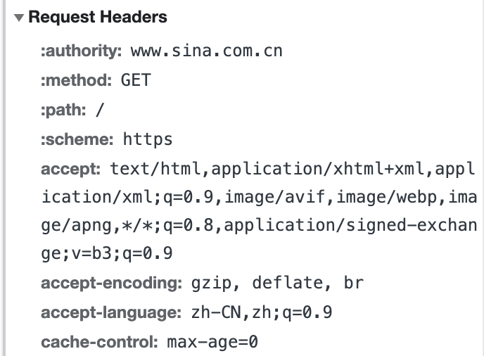
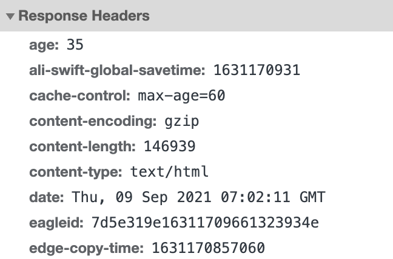
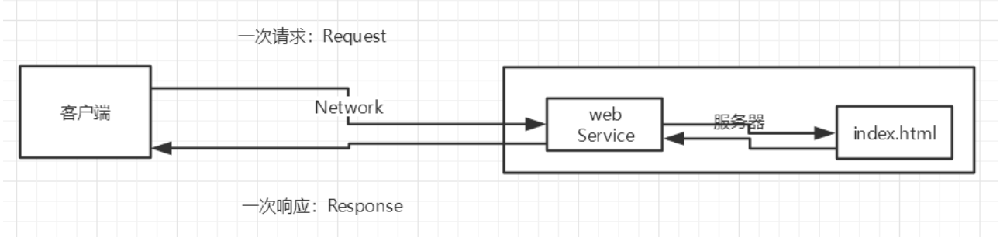
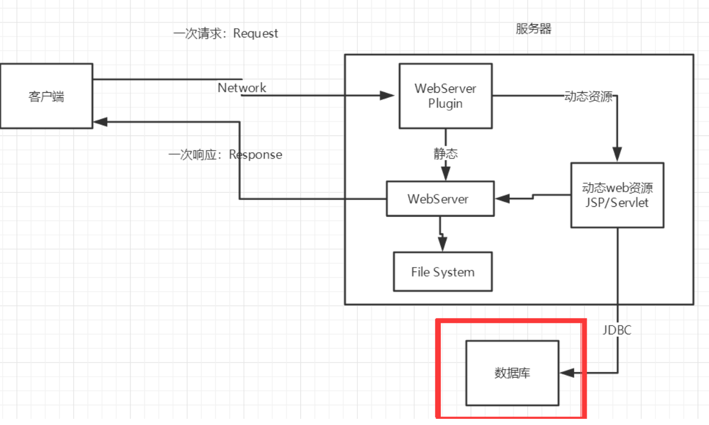

# Maven安装

vim ~/.zshrc

按i进入编辑模式

然后复制
```
export MAVEN_HOME=/Users/shawn/apache-maven-3.8.1
export PATH=$PATH:$MAVEN_HOME/bin
```
source ~/.zshrc

mvn -v

阿里云镜像

新建一个文件夹，然后设置为仓库（狂神javaweb）

想使Mac terminal显示行号，
在vi编辑器中，按下ESC，然后输入冒号，输入以下命令：

set number

vi 编辑器中会出现行号。


# IDEA使用maven

maven用自己的  
setting用自己的conf目录下  
仓库用自己的  

文件夹右键可以标注为源码目录，mark  directory as。才可以在里面新建class

## tomcat9安装配置启动
https://blog.csdn.net/qq_42685053/article/details/118248642?ops_request_misc=%257B%2522request%255Fid%2522%253A%2522162968672516780269814682%2522%252C%2522scm%2522%253A%252220140713.130102334..%2522%257D&request_id=162968672516780269814682&biz_id=0&utm_medium=distribute.pc_search_result.none-task-blog-2~all~baidu_landing_v2~default-1-118248642.first_rank_v2_pc_rank_v29&utm_term=Tomcat+m1&spm=1018.2226.3001.4187

cd 到tomcat的bin文件夹
然后sh startup.sh (sudo?)

主义环境变量改成自己的文件夹

https://mvnrepository.com/artifact/org.springframework/spring-webmvc/5.3.9
搜索复制dependency

然后点一下右边的maven刷新

# Web

访问网站，使用App时都是基于Browser/Server模式，BS架构。服务器端升级后，客户端无需任何部署就可以使用到新的版本。


- 静态web，html，css静态资源，不会发生任何变化
- 动态web，数据会变化，淘宝几乎所有网站都是动态web，技术栈：servlet/ISP，ASP，PHP

动态web资源开发的技术统称为JavaWeb

## HTTP

- html是定义网页的文本
- HTTP是传输HTML的协议，基于TCP协议之上的请求-响应协议。

对于Browser的流程

1. 与服务器建立TCP连接；
2. 发送HTTP请求；
3. 收取HTTP响应，然后把网页在浏览器中显示出来。



```http
GET / HTTP/1.1
Host: www.sina.com.cn
User-Agent: Mozilla/5.0 xxx
Accept: */*
Accept-Language: zh-CN,zh;q=0.9,en-US;q=0.8
```

- Host:因为一个服务器上可能运行着多个网站，因此，Host表示浏览器正在请求的域名；
- User-Agent: 浏览器标识
- Accept：表示浏览器能接收的资源类型
- 语言
- Accept-Encoding：表示浏览器可以支持的压缩类型，例如`gzip, deflate, br`



```http
HTTP/1.1 200 OK
Content-Type: text/html
Content-Length: 21932
Content-Encoding: gzip
Cache-Control: max-age=300

<html>...网页数据...
```

2xx代表成功，3xx代表重定向，4xx表示客户端错误，5xx服务端错误

- Content-Type：响应内容的类型`text/html`，`image/jpeg`；
- Content-Length：响应内容的长度（字节数）；
- Content-Encoding：响应压缩算法，`gzip`；
- Cache-Control：指示客户端应如何缓存，例如`max-age=300`表示可以最多缓存300秒。

HTTP请求和响应都由HTTP Header和HTTP Body构成，每行都以`\r\n`结束，两个连续的`\r\n`，那么后面就是HTTP Body。HTTP Body并根据Header信息显示网页、图像或其他内容。

通常浏览器获取的第一个资源是HTML网页，如果嵌入了图片视频等，会根据资源的URL再次请求。

HTTP编程（网络编程）是以客户端的身份去请求服务器资源。现在，我们需要以服务器的身份响应客户端请求，编写`服务器程序`来处理客户端请求通常就称之为Web开发。

### HTTP Server


## web应用程序

a.html可以被外界访问，www.baidu.com/index.html，放在某个计算机上  
URL:资源定位符？  

一个web应用由多部分组成（静态，动态）：  
- html，css，js
- jsp，servlet
- Java程序
- jar包
- 配置文件 （Properties）
  

客户端向服务器发一次请求request，服务器给客户端发一次响应response


访问的是webService，然后web服务器请求返回index.html，再返回给客户端，也就是说，服务器分为webservice和index等文件。



### 静态页面

- 轮播图，点击特效
- JavaScript伪动态
- VBScript
- 无法和数据库交互（用户无法交互）

### 动态界面

响应因人而异




假如web资源出现错误，需要重新编写后台并发布。（停机维护）

## web服务器

动态web实现有如下

- ASP 微软，在html里嵌入VB，代码混乱 ASP+COM

  ```html
  <h1>
      <h1><h1> 
          <h1>
              <h1>
                  <h1> 
        <h1>
            <%
            System.out.println("hello") 
            %>
            <h1>
              <h1> 
       <h1><h1>
   <h1> 
  ```

- php，跨平台速度快代码简单，无法承载大访问量，但仍然大占有率

- JSP/Servlet：

  B/S：浏览器和服务器

  C/S：客户端和服务器

  - sun公司
  - 基于Java语言！
  - 可承载高并发可用性能
  - 语法像ASP
  - JSP文件就是在html代码中嵌入一些java代码

服务器是被动的，处理请求和响应：

- IIS 微软

- Tomcat

  是一个免费的开放源代码的Web 应用服务器，属于轻量级应用服务器，在中小型系统和并发访问用户不是很多的场合下被普遍使用，是开发和调试JSP 程序的首选。对于一个Java初学web的人来说，它是最佳的选择

- tomcat的默认端口号为：8080

- mysql：3306

- http：80

- https：443

  127.0.0.1

在tomcat的conf setting配置文件里可以修改启动的端口号（8080），还有主机的名称（localhost）

访问网站：

- 先检查本机hosts配置文件下有无这个域名的映射，比如127.0.0.1 localhost
- 如果没有就去dns服务器找，dns管理全球的域名，比如baidu就映射到 远程地址: 163.177.151.109:443
- tomcat环境变量

## 发布web网站

将自己写的网站，放到服务器(Tomcat)中指定的web应用的文件夹（webapps）下，就可以访问了

- index.html默认的首页
- classes文件夹 java程序
- lib 网站应用依赖的jar包
- web.xml 网站配置

## http

超文本传输协议http，运行在TCP之上，超文本：图片视频音乐

https：443，安全

http 1.0 1.1，1.1可以获得多个资源

网页f12：

### 请求

请求行

```html
请求 URL: https://www.baidu.com/
请求方法: GET
状态代码: 200 OK
远程地址: 163.177.151.109:443
引用站点策略: strict-origin-when-cross-origin
```

请求头

```html
Accept: text/html,application/xhtml+xml,application/xml;q=0.9,image/webp,image/apng,*/*;q=0.8,application/signed-exchange;v=b3;q=0.9
Accept-Encoding: gzip, deflate, br 支持哪种编码
Accept-Language: zh-CN,zh;q=0.9,en;q=0.8,en-GB;q=0.7,en-US;q=0.6Cache-Control: 语言环境
Cache-Control 缓存控制
Connection: keep-alive 断开还是保持连接
HOST 主机
```

请求行中的请求方式：GET

请求方式：Get，Post，HEAD,DELETE,PUT,TRACT…

get：请求能够携带的参数比较少，大小有限制，会在浏览器的URL地址栏显示数据内容，不安全，但高效 www.baidu.com/username=hello

post：请求能够携带的参数没有限制，大小没有限制，不会在浏览器的URL地址栏显示数据内容，安全，但不高效。

### 响应

```html
Bdpagetype: 2
Bdqid: 0xe8e9bf7100013b22
Cache-Control: private 缓存控制 
Connection: keep-alive 连接
Content-Encoding: gzip 编码 
Content-Type: text/html;charset=utf-8 类型
。。。。
```

响应体

```html
Accept：告诉浏览器，它所支持的数据类型 
Accept-Encoding：支持哪种编码格式 GBK UTF-8 GB2312 ISO8859-1 
Accept-Language：告诉浏览器，它的语言环境 
Cache-Control：缓存控制 
Connection：告诉浏览器，请求完成是断开还是保持连接 
HOST：主机..../. 
Refresh：告诉客户端，多久刷新一次； 
Location：让网页重新定位；
```

响应状态码

- 200:请求响应成功
- 3**：重定向，到新位置去
- 404，4**:找不到资源
- 5**：服务器代码错误

# Servlet

Servlet程序

- 实现Servlet接口
- 将java类部署到web服务器中

实现了Servlet接口的java程序叫做Servlet

Java servlet api, JavaServer Pages(TM) API

## Servlet原理

