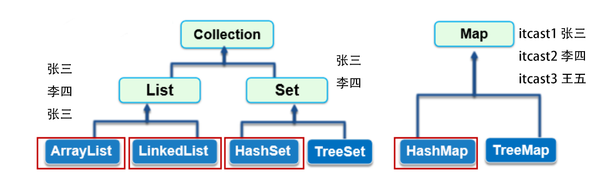

# 集合




- List：有序列表的集合
- Set：没有重复元素的集合
- Map：通过键值查找的映射表集合

| List | Set  | Map                         |
| ---- | ---- | --------------------------- |
|      |      | 可以通过key快速找到value    |
|      |      | key（第一个值）是不能重复的 |
|      |      |                             |
|      |      |                             |


## 异或

异或：（两种）

- 自反a^b^a=b，不要用乘法自己算
- a^a=0
- a^0=a
- 交换律

20^20^21=21 

21^21^22=22

22^23^23=22

22^24^24=22


使用`Objects.equals()`两个引用类型都是`null`时它们也是相等的。

# Map

```java
package com.itranswarp.learnjava;

import java.util.*;

/**
 * Learn Java from https://www.liaoxuefeng.com/
 * 
 * @author liaoxuefeng
 */
public class Main {
	public static void main(String[] args) {
		List<Student> list = List.of(new Student("Bob", 78), new Student("Alice", 85), new Student("Brush", 66),
				new Student("Newton", 99));
		var holder = new Students(list);
		System.out.println(holder.getScore("Bob") == 78 ? "测试成功!" : "测试失败!");
		System.out.println(holder.getScore("Alice") == 85 ? "测试成功!" : "测试失败!");
		System.out.println(holder.getScore("Tom") == -1 ? "测试成功!" : "测试失败!");
	}
}

class Students {
	List<Student> list;//可能是一个数据量很大的表
	Map<String, Integer> cache;//cache用来存放查询频率很高的数据

	Students(List<Student> list) {
		this.list = list;
		cache = new HashMap<>();
	}

	int getScore(String name) {
		// 先在Map中查找:
		Integer score = this.cache.get(name);//如果查到，下一步返回
		if (score == null) {//如果查不到，再在巨大的表格中找
			// TODO:
			score = findInList(name);
			if(score !=null) {
				cache.put(name, score);//如果查到，就把它放到cache中，下次找就更快了
			}
		}
		return score == null ? -1 : score.intValue();
	}

	Integer findInList(String name) {
		for (var ss : this.list) {
			if (ss.name.equals(name)) {
				return ss.score;
			}
		}
		return null;
	}
}
class Student {
	String name;
	int score;
	Student(String name, int score) {
		this.name = name;
		this.score = score;
	}
}
```


# hashcode

hashCode()返回的`int`范围高达±21亿。其数组默认大小为16

```java
int index = key.hashCode() & 0xf; // 0xf = 15
```

把索引确定在0～15

